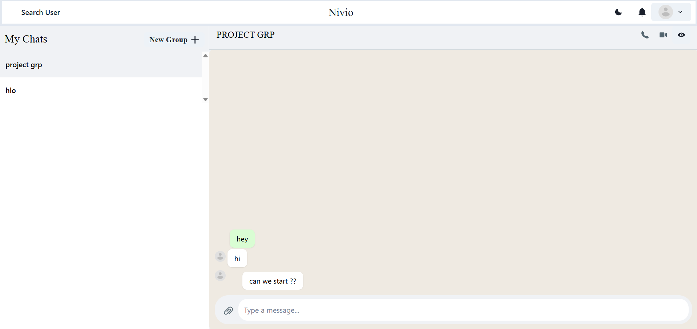

# 💬 Nivio - Full Stack Real-Time Chat Application

> **Nivio** is a robust, feature-rich messaging platform built with the MERN stack. It offers a seamless communication experience comparable to modern apps like WhatsApp, featuring real-time messaging, group chats, video/voice calling, and media sharing.

---

## ✨ Features

### 🔐 Authentication & Security
- **Secure Login/Signup:** JWT (JSON Web Token) authentication.
- **Guest Login:** Quick access for testing without registration.
- **Password Encryption:** BcryptJS for secure password hashing.

### 💬 Real-Time Messaging
- **Instant Chat:** Powered by **Socket.io** with zero latency.
- **Typing Indicators:** Real-time "User is typing..." animation (Lottie).
- **Read Receipts:** Instant message delivery updates.
- **Notifications:** Real-time notification badges for new messages.

### 👥 Group Chat Functionality
- **Create Groups:** Add multiple users to a single conversation.
- **Admin Controls:** Rename groups, add/remove members.
- **Leave Group:** Users can exit groups at any time.

### 📹 Video & Voice Calling
- **Integrated Video Calls:** High-quality video conferencing using **ZegoCloud**.
- **Voice-Only Mode:** Dedicated audio call option.
- **Group Calls:** Support for multiple participants in a single call.

### 📷 Media Sharing & UI
- **Image Sharing:** Upload and send images via **Cloudinary**.
- **WhatsApp-Style UI:** Clean, split-screen desktop layout.
- **Dark/Light Mode:** Toggle themes for better accessibility.
- **Responsive Design:** Optimized for both desktop and mobile views.

---

## 🛠️ Tech Stack

| Component | Technology |
| :--- | :--- |
| **Frontend** | React.js, Chakra UI, Context API, React Router |
| **Backend** | Node.js, Express.js |
| **Database** | MongoDB, Mongoose |
| **Real-Time** | Socket.io |
| **Video/Voice** | ZegoCloud SDK |
| **File Storage** | Cloudinary API |
| **Authentication** | JWT, BcryptJS |

---



## ⚙️ Installation & Setup

Follow these steps to run Nivio locally on your machine.

### 1. Clone the Repository
```bash
git clone [https://github.com/SohiniManne/Nivio.git](https://github.com/SohiniManne/Nivio.git)
cd nivio
2. Backend SetupNavigate to the backend folder and install dependencies:Bashcd backend
npm install
Create a .env file in the backend folder and add the following:Code snippetPORT=5000
MONGO_URI=your_mongodb_connection_string
JWT_SECRET=your_secret_key
3. Frontend SetupNavigate to the frontend folder and install dependencies:Bashcd frontend
npm install
4. Run the ApplicationYou can run both servers concurrently (if configured) or separately.Start Backend:Bashcd backend
npm start
Start Frontend:Bashcd frontend
npm start
Open http://localhost:3000 to view it in the browser.
🤝 ContributingContributions are welcome! Please fork the repository and create a pull request.
📄 LicenseThis project is licensed under the MIT License.Developed with ❤️ by Sohini Manne
